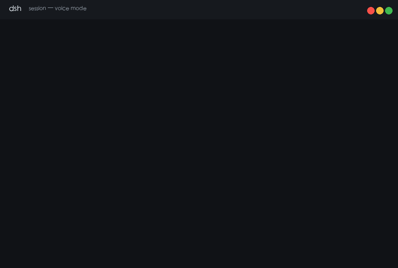

# dsh-voice

Full-duplex voice mode for DeepSeek Harness: streamed ASR → LLM → TTS with barge-in.

## Status

**v0.4.0 — barge-in complete. The full voice loop is wired end to end.**

Speak into the composer mic: the assistant silences itself (playback stops,
host synthesis queue drops), the running turn is cancelled (the stop-button
route), and your speech is transcribed locally and submitted. The reply
streams back as spoken audio with live captions.

Known limitation: barge-in detection is triggered by the mic's leading
speech edge, which relies on browser-level echo cancellation
(`getUserMedia({ echoCancellation: true })`). Loud TTS playback may leak
into the mic on some platforms; there is no JS-level AEC.

## Demo



The loop: a user prompt streams back as spoken audio sentence-by-sentence,
then the user's voice interrupts playback and stops the running turn
mid-reply (true barge-in). The mic keeps recording the new speech.

## How it works

```
input:  mic ──RMS endpoint detection──▶ whisper (browser, q8 onnx)
                                           │ text
                                           ▼
        composer draft ──submit──▶ model stream ──llm/stream tap──▶ SentenceSegmenter
                                                                     │
        browser ◀── SSE /dsh-voice-api/stream ── TtsQueue (msedge-tts) ◀──┘
                  (base64 MP3 frames + caption text)

barge-in: speech edge ──▶ engine.skip() + POST /cancel (epoch bump)
                         + session.cancel() when a turn is running
```

- The `llm/stream` tap is **lossless**: every chunk is yielded unchanged, the
  segmenter only observes. The model stream is never blocked by synthesis.
- ASR runs **fully locally** in the browser: transformers.js loads from a
  CDN via a native dynamic import (kept intact by esbuild
  `supported: { 'dynamic-import': true }`), the whisper model streams from
  the configured model host with browser-cache enabled. No API key, no
  server-side speech processing.
- RMS endpoint detection: 16kHz getUserMedia, 1.3s trailing-silence cutoff,
  max 30s segment, pre/post padding. Zero dependencies.
- Barge-in is three-layered: local playback queue cleared, host `TtsQueue`
  epoch bumped (queued AND in-flight synthesis dropped), and the running
  turn cancelled when `session.running` is true. An aborted turn never
  flushes its trailing half-sentence — exactly what the user interrupted.
- `modelHost` accepts any HF-compatible mirror (e.g. `https://hf-mirror.com`
  for CN networks).

## API

| Route | Purpose |
|-------|---------|
| `GET /dsh-voice-api/stream` | SSE; `event: audio` frames `{sessionId, seq, text, audio(base64 MP3)}` |
| `POST /dsh-voice-api/cancel` | `{sessionId}` drops queued + in-flight synthesis (epoch bump) |
| `GET /dsh-voice-api/config` | ASR runtime config `{asr: {...}}` for the mic button |
| `GET /dsh-voice-api/*` | ping: `{ok, name, enabled}` |

Config (bundle patch row):

```yaml
- id: voice
  name: '@haoku123/dsh-voice'
  config:
    voice: zh-CN-XiaoxiaoNeural
    asr:
      model: onnx-community/whisper-base   # or whisper-tiny / whisper-small
      modelHost: https://huggingface.co    # or https://hf-mirror.com
      cdnBase: https://cdn.jsdelivr.net/npm/@huggingface/transformers@4.2.0/+esm
      language: zh                         # zh | en | auto
      autoSend: false
      mode: toggle                         # toggle | hold
```

## Install

```sh
dsh plugin --profile web add <repo-url-or-path>
dsh --profile web
```

Note: needs Node ≥ 22.19 or ≥ 24 (`node:zlib` zstd APIs).

## Tests

```sh
npm test                                # segmenter unit tests (pure, no network)
node test/host.integration.test.mjs     # llm/stream tap + real Edge TTS + SSE + /config
node test/bargein.test.mjs              # client inject face wiring (skipPlayback/cancelTurn)
node test/bargein-semantics.test.mjs    # aborted turn no-flush + cancel drops in-flight
node verify-client.mjs                  # client bundle registration/exports/slots/dynamic-import
```
